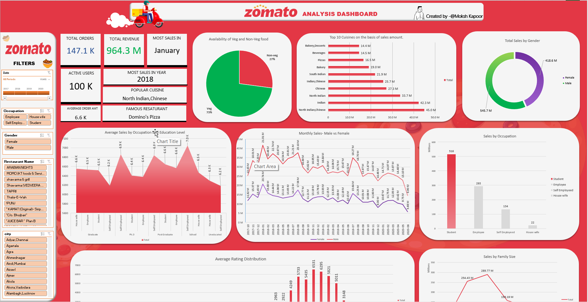
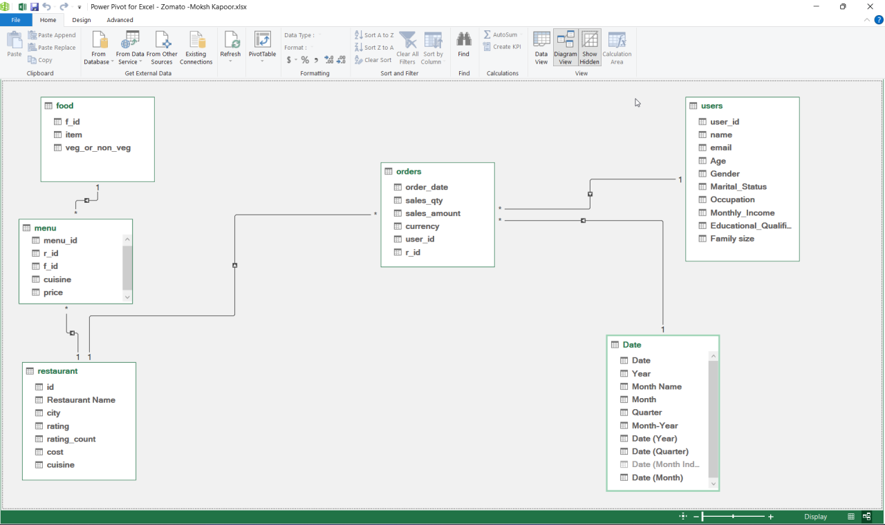
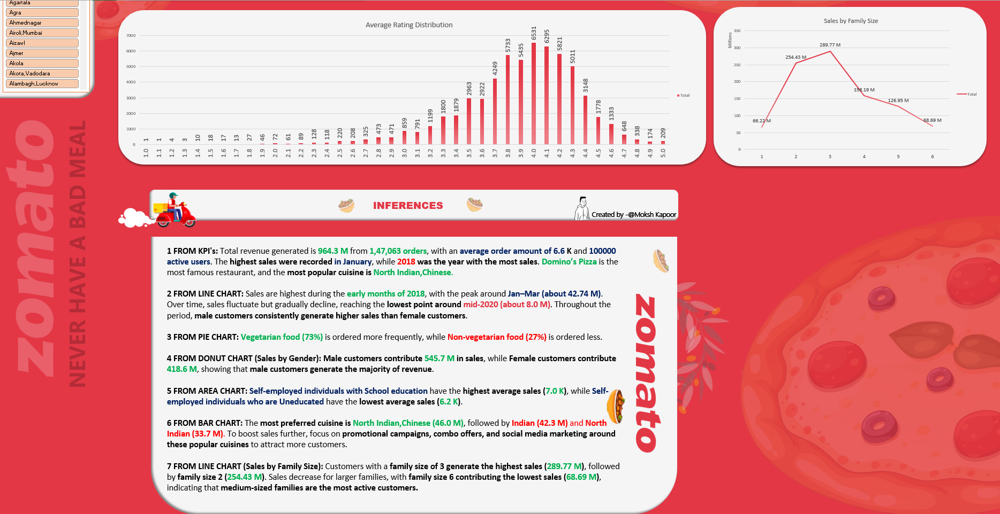
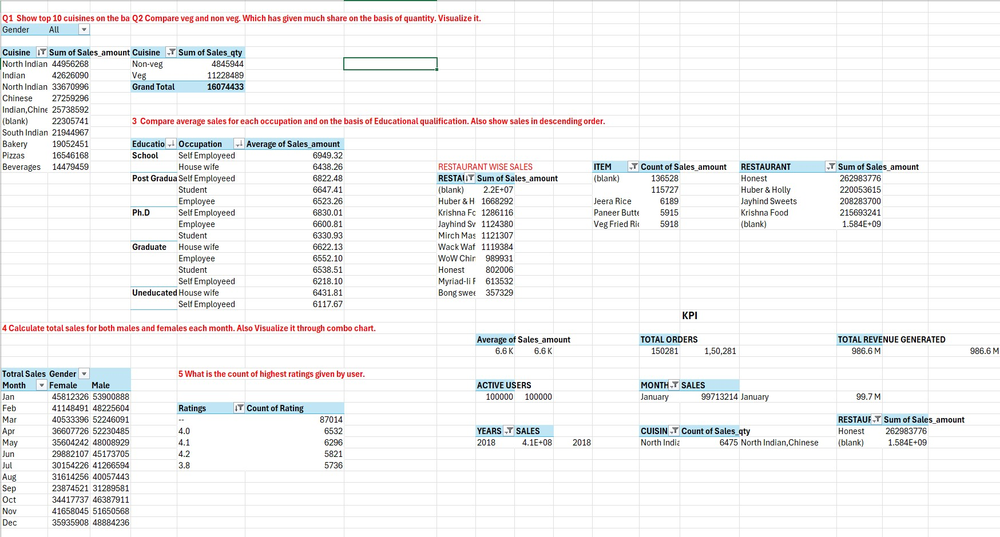

# Zomato Sales & Customer Analytics

An interactive **Excel Power Pivot dashboard project** analyzing Zomato sales trends, customer behavior, restaurant performance, and cuisine popularity using a multi-table dataset.

---

## 📌 Project Overview

This project focuses on **Zomato Sales & Customer Analytics**, where I built an interactive dashboard to analyze:

- Customer behavior
- Restaurant performance
- Sales trends
- Cuisine popularity
- User demographics
- Revenue drivers

The analysis was performed using a multi-table dataset with tables such as:

- **Food**
- **Menu**
- **Orders**
- **Restaurant**
- **Users**

These tables helped analyze cuisine preference, customer spending patterns, ratings, and overall platform performance.

---

## 🎯 Business Objective

The main objective of this project was to identify:

- Key revenue drivers
- Customer preferences
- Sales trends across demographics and time
- High-performing restaurants and cuisines
- Segment-wise spending behavior

This analysis supports better decisions related to:

- Menu optimization
- Customer targeting
- Seasonal promotions
- Revenue growth

---

## 📊 Dataset Overview

This project is based on a Zomato food delivery and restaurant analytics dataset that includes multiple interconnected tables.

The dataset covers:

- Food items
- Restaurant menus
- Customer orders
- Restaurant details
- User demographics

### Key Tables Used
- Food
- Menu
- Orders
- Restaurant
- Users

Together, these tables provide information on:

- Food type (Veg / Non-Veg)
- Cuisine
- Pricing
- Order quantity
- Total sales
- Customer profile
- Ratings
- Order date

---

## 🛠 Tools & Techniques Used

- **Microsoft Excel**
- **Power Query** – Data cleaning & transformation
- **Power Pivot** – Data modeling & relationships
- **Pivot Tables & Pivot Charts**
- **Interactive Dashboard with KPIs and Slicers**
- **Calculated Fields**
- **Relational Data Modeling**

---

## 🧩 Data Preparation & Modeling

### Power Query Cleaning
- Renamed columns
- Removed unnecessary indexing columns
- Handled null values
- Standardized formats
- Removed special characters from cost fields
- Extracted email domains
- Generated time-based fields such as:
  - Month
  - Year
  - Month-Year

### Power Pivot Model
A relational data model was built in Power Pivot connecting:

- **Users**
- **Orders**
- **Restaurants**
- **Menu**
- **Food**

Here:
- **Orders** acts as the fact table
- It is connected to **Users** and **Restaurants**
- Restaurants are further connected to **Menu** and **Food**

---

## ⚠️ Dataset Limitation

One limitation of the dataset was that orders were recorded at the **restaurant level rather than item level**, meaning individual food items within each order were not tracked.

Because of this:
- Item-level sales analysis could not be derived directly from order data
- Menu-level analysis was used instead to compare:
  - Veg vs Non-Veg availability
  - Cuisine distribution

---

## 🔍 Key Insights

### 1. KPI Overview
- Total revenue: **964.3M**
- Total orders: **147,063**
- Average order value: **6.6K**
- Active users: **100,000**
- Highest sales were recorded in **January**
- **2018** had the highest sales overall
- **Domino’s Pizza** was the most popular restaurant
- The most preferred cuisines were **North Indian** and **Chinese**

### 2. Sales Trend Analysis
- Sales were highest during early **2018**, peaking around **January–March**
- Sales gradually declined toward **2020**
- Male customers consistently generated higher sales than female customers

### 3. Food Preference
- **Vegetarian food:** 73%
- **Non-vegetarian food:** 27%

### 4. Sales by Gender
- Male customers: **545.7M**
- Female customers: **418.6M**

### 5. Sales by Occupation & Education
- Self-employed customers with **School education** showed the highest average sales
- Self-employed customers who were **Uneducated** showed the lowest average sales

### 6. Cuisine Popularity
- **North Indian & Chinese:** 46.0M
- **Indian:** 42.3M
- **North Indian:** 33.7M

### 7. Sales by Family Size
- Family size **3** generated the highest sales
- Family size **2** followed next
- Family size **6** contributed the lowest sales

---

## 💡 Recommendations

- Domino’s Pizza most popular / North Indian & Chinese highest sales  
  → Strengthen partnerships with top-performing restaurants and cuisines  
  → Introduce exclusive deals and promote best-selling menu items  

- Sales declined toward 2020 / fluctuations over time  
  → Launch targeted campaigns during low-performing periods to stabilize sales  

- Vegetarian food = 73%  
  → Expand vegetarian menu options and promote plant-based offerings  

- Male customers contribute more revenue than female customers  
  → Create personalized offers and loyalty programs for female customers  

- Different spending across occupation and education  
  → Use targeted discounts for lower-spending customer segments  

- Cuisine popularity insights  
  → Run cuisine-focused campaigns such as combo deals and food festivals  

- Family size 3 and 2 generate highest sales  
  → Create family combo meals for medium-sized families  


---

## 📈 Dashboard Preview

### 🎥 Dashboard Walkthrough Video


### 📸 Dashboard Screenshot


### 🧠 Schema


### 📊 Key Findings


### 🔧 Workings


---

## 📂 Repository Structure

```bash
zomato-sales-customer-analytics/
├── Images/
│   ├── Schema.png
│   ├── Zomato.gif
│   ├── Zomato_Inferences.png
│   ├── workings.jpg
│   └── zomato.png
└── README.md
```

---

📢 Conclusion
This project demonstrates how Excel dashboards can transform raw food delivery data into meaningful business insights.
By analyzing order patterns, customer preferences, and delivery performance, we can identify opportunities to improve:

- Customer satisfaction
- Delivery efficiency
- Revenue growth
- Restaurant partnerships

---

## 👤 Author

**Moksh Kapoor**  
Aspiring Data Analyst  

<p>
  🔗 <strong>LinkedIn:</strong> 
  <a href="https://www.linkedin.com/in/moksh-kapoor-618495322/" target="_blank" style="text-decoration:none; color:#0A66C2; font-weight:bold;">
    Visit My LinkedIn Profile
  </a>
</p>

📢 You can also check this project on my LinkedIn post: 
<a href="https://www.linkedin.com/posts/moksh-kapoor-618495322_dataanalytics-dataanalysis-excel-activity-7438566531006894080-w_mV?utm_source=share&utm_medium=member_desktop&rcm=ACoAAFGVzjQBQzKnpNzkuOZayyyvYW4FkHnrf28" target="_blank">
View Post 🚀
</a>

If you like this project, ⭐ **give it a star** on GitHub to show your support!
